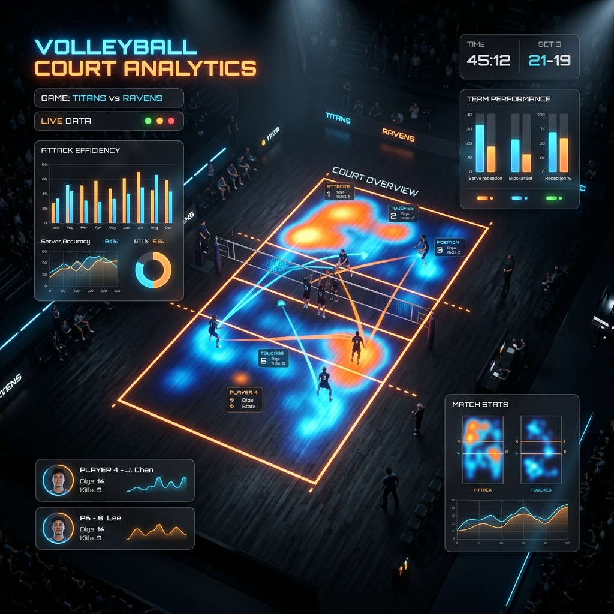

# 🏐 FSBO Predictability Score: UCSD Triton Analytics



## 📊 Overview

The **FSBO (First Swing Side Out)** Predictability Score project is a data-driven initiative aimed at decoding the offensive patterns of the **UC San Diego (UCSD) Volleyball** team. By leveraging granular play-by-play data, this project builds a predictive ecosystem to anticipate attack locations following high-quality service receptions.

In elite volleyball, "winning the first swing" is a critical factor in side-out efficiency. This project utilizes machine learning to transform raw historical data into actionable insights for scouting and strategic optimization.

---

## 🚀 Key Features

### 🔍 Predictive Intelligence
- **Multi-Class Classification**: Predicts the target attack location across four primary zones: `Front`, `Middle`, `Back`, and `Pipe`.
- **Advanced Modeling**: Orchestrates Gradient Boosting and Neural Network architectures to maximize predictive accuracy.

### 🧠 Temporal Memory Architecture
- **Sliding Window Context**: Incorporates the last 5 attack sequences (`prev_1` through `prev_5`) as inputs, capturing the setter's recent tendencies and situational bias.
- **Momentum Tracking**: Quantifies offensive "streaks" using a `consecutive_same` attack variable to identify repetitive play-calling patterns.

### 📍 Spatial & Contextual Inputs
- **Rotation Logic**: Models the impact of `setter_position` (rotations 1-6) on offensive distribution.
- **Game Flow**: Integrates `score_diff` and `set_number` to account for high-pressure adjustments and late-set decision-making.

---

## 🛠️ Technical Stack

| Category | Tools |
| :--- | :--- |
| **Language** |  |
| **Data Processing** | `Pandas`, `NumPy`, `Scikit-Learn` |
| **Machine Learning** | `XGBoost/GradientBoosting`, `PyTorch` |
| **Visualization** | `Seaborn`, `Matplotlib` |

---

## 📈 Exploratory Data Analysis

The project includes a robust EDA suite centered on the **UCSD Triton's** offensive profile:
- **Target Distribution**: Analyzes the frequency of sets to different hitters.
- **Quality Correlation**: Maps `reception_quality` (Perfect vs. Positive) to the eventual attack outcome.
- **Setter Profiling**: Unique identifiers for `setter_id` allow for individual-based tendency tracking.

---

## 📂 Project Structure

```bash
├── FSBO_tritonball.ipynb      # Main analytics and modeling notebook
├── Play-by-Play.csv           # Raw granular match dataset (excluded from git)
├── assets/                    # Project visualizations and branding
└── README.md                  # Project documentation
```

---

## ⚙️ Installation & Usage

1. **Clone the repository**:
   ```bash
   git clone https://github.com/[your-username]/FSBO-predictibility-score.git
   ```

2. **Install Dependencies**:
   ```bash
   pip install pandas numpy torch scikit-learn seaborn matplotlib
   ```

3. **Run the Analysis**:
   Open `FSBO_tritonball.ipynb` in your preferred Jupyter environment (JupyterLab, VS Code, or Google Colab) and execute the cells sequentially.

---

## 🏛️ Acknowledgments
This project is dedicated to the **UC San Diego Athletics** department and the Triton Volleyball program. Data processing techniques were developed to enhance competitive performance through advanced sport science and statistical modeling.

---
<p align="center">
  <i>"Predicting the swing before it happens."</i>
</p>
